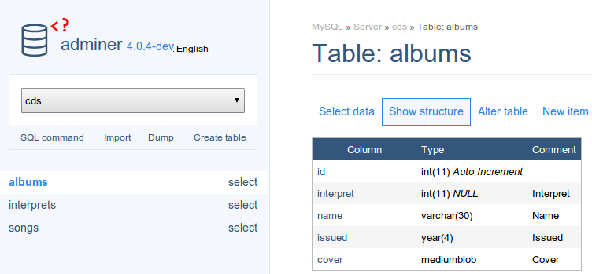
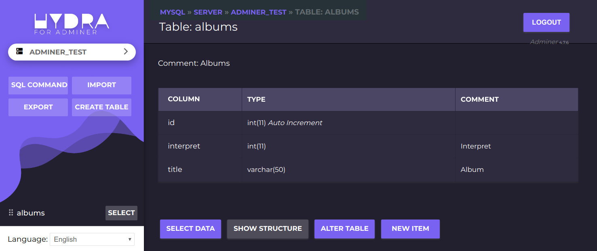

# MyAdminer [foolsecret/adminer]
<br><br>

> #### SLOGN <br>
> 增加了第三方CSS样式的 **Adminer**工具。

<br><br>

## 使用说明

### 一、Docker 镜像启动
``` powershell
docker run -d --name adminer -p 8080:80 foolsecret/alpine
```
⚠️ 只需要指定端口绑定
<br><br>

### 二、docker-compose.yml
``` yaml
version: "3.3"

services: 
  adminer:
    container_name: "Adminer"
    image: foolsecret/alpine
    restart: "always"
    # 必须指定端口绑定
    ports: 
      - 8080:80
```
<br><br>

## 镜像版本说明
### latest
最新版本，也是默认版本。

<br><br>
## 主题示例

**Pepa Linha**：默认使用。


<br>

**Hydra**：（暗色）默认使用。


------
<br><br>

## 开发初衷
平时开发中，需要一款可以在线管理数据库的应用，phpMyAdmin相对而言功能比较完整，但缺点也显而易见，占用资源比较大。而 **adminer** 很精简，功能刚刚好。  但是默认的样式比较LOW，所以我为它引入了第三方的CSS样式。

开始的开始，只是作为本地文件使用，通过PHP命令本地启动。但是局限性也很强，需要依赖本地的PHP环境。
这次我引入了**Docker**支持，直接通过Docker启动我制作好的镜像即可使用了。

现在免费开源给大家使用喽。
希望能帮到大家。
<br><br>

## CHANGE LOG

### 2020-12/17
- 仅支持 **Mysql**、**MariaDB** 数据库的操作
- 添加 *Pepa Linha* CSS样式
- **Docker**镜像支持

### 2020-12/01 之前
- 完整的**adminer**支持